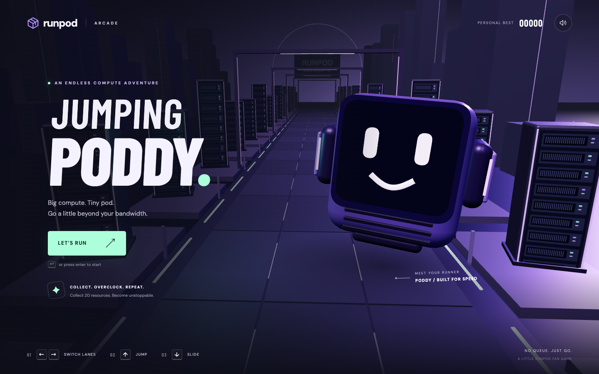

# Jumping Poddy

A Three.js endless runner starring Poddy, RunPod's mascot. Dodge server racks, jump GPUs and shipping boxes, and collect inference resources through a neon datacenter.

**[Play Jumping Poddy](https://forma.cam/runpod/)**



## Run locally

Use Node.js 22.12 or newer and npm.

```sh
git clone https://github.com/vavo/jumping-poddy.git
cd jumping-poddy
npm ci
npm run dev
```

Open **http://127.0.0.1:5199/**. The game needs WebGL and browser hardware acceleration. Sound starts after your first interaction.

## Controls

| Action | Keyboard | Mobile |
| --- | --- | --- |
| Change lanes | Left / Right or A / D | Swipe left / right |
| Jump | Up, W or Space | Swipe up |
| Slide / dive | Down or S | Swipe down |
| Pause / resume | P or Escape | Pause button |
| Start / retry / resume | Enter | Menu button |
| Fullscreen | F | Browser support varies |

Mobile players can also use the on-screen movement buttons.

## The run

- Switch between three lanes. Jump low hardware and slide beneath overhead obstacles.
- Collect mint inference chips for 50 points each, plus 3 points per metre travelled.
- Collect 20 chips outside Overclock to activate eight seconds of automatic pickup and collision protection.
- Survive as the speed increases. Each obstacle row leaves at least one lane open.

The game saves your best score and sound preference in your browser. Play needs no account, API key, or backend.

## Build and test

```sh
npm test
npm run build
npm run preview
```

The production build goes to `dist/` and uses the `/runpod/` base path. Preview it at **http://127.0.0.1:5200/runpod/**.

## Documentation

- [Gameplay](docs/gameplay.md): obstacles, scoring, Overclock, and saved progress.
- [Development](docs/development.md): source layout, simulation, and browser test hooks.
- [Deployment](docs/deployment.md): static hosting, Nginx routing, verification, and rollback.

## Built with

Three.js, TypeScript, Vite, and Web Audio. The project bundles Barlow Condensed and DM Sans through Fontsource. Code generates Poddy, the environment, hardware, and sound effects.

Poddy is RunPod's mascot. This is an unofficial fan game based on the supplied mascot reference, with no RunPod endorsement implied. Third-party names and assets remain the property of their respective owners.
